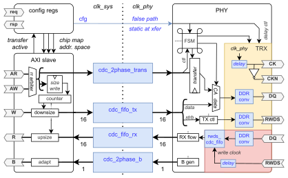

# HyperBus v2

This peripheral implements an AXI4-compliant interface for the HyperBus protocol, described [in its specification](https://www.cypress.com/file/213356/download). Hyperbus is mainly used for off-chip memories (HyperFlash and HyperRAM), but also supported by some generic peripherals.

## Features

The AXI data widths are parameterizable from 16 to 1024, with transfers of all sizes possible. The main restrictions are as follows:

- Atomics are not supported.
- Only linear bursts are supported.
- All accesses except byte-size accesses must be aligned to 16-bit boundaries.

The address width is also fully parameterizable. We support bursts of any size permitted by AXI and stalling through PHY-level clock stopping and protocol-level burst splitting. We do _not_ buffer bursts to support devices without the clock stop feature; please ensure your device supports clock stop or ensure sufficient buffering upstream.

The configuration register interface uses the minimal Regbus protocol. Data and address widths are parameterizable, but register sizes must be a power of two larger than 16 bits.

### Improvements

This is a reimplementation of the original HyperBus interface, developed in the Semester thesis _Towards a more efficient HyperBus implementation_ by Armin Berger and Stefan Keck. We improved on the original design in the following ways:

- A simpler PHY with new features:
    - A comprehensible, minimal FSM
    - Careful clocking design isolated within a TRX sub-block
    - Use of controllable `generic_delay` macros instead of wasteful supersampling
    - Support for in-transfer stalling through clock stop
- A simpler AXI frontend with wider support:
    - Specialized data width conversion instead of large, overly general design
    - Support for arbitrary 16-bit-aligned transfers and 8-bit-aligned byte transfers (see above)
    - Blocking of concurrent IDs and simultaneous read/write
    - Atomics filtering
- A cleaner and more robust project:
    - Extraction of clock generation and reset synchronization
    - Vastly improved code quality
    - Elimination of numerous bugs
    - Reduction of sub-designs and dependencies

## Architecture

The block diagram below outlines the approximate architecture. Note that there are *two* internally provided clock domains,`clk_sys` and `clk_phy`, as well as an incoming clock `clk_rwds_in` which is a delayed, gated variant of `clk_phy` sent back by the peripheral for read sampling.

## ToDos

- [ ] Extensive verification
    - [ ] Random transfers
    - [ ] Random AXI timing
    - [ ] More memories
- [ ] PSRAM support through additional CA decoder
- [ ] Tested silicon implementation in Zest
